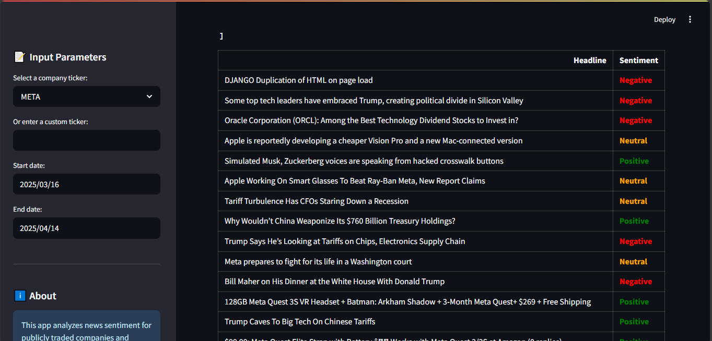
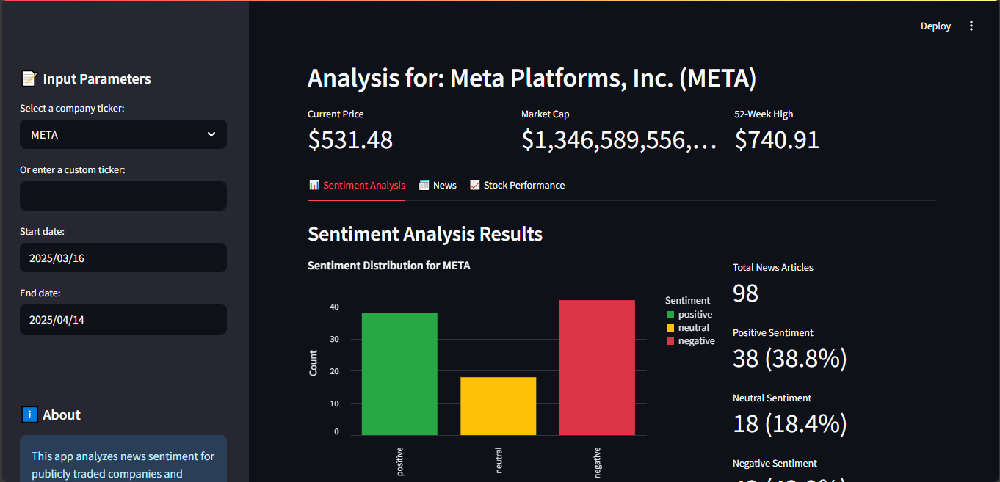
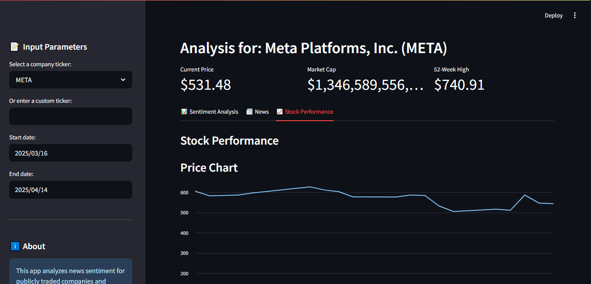
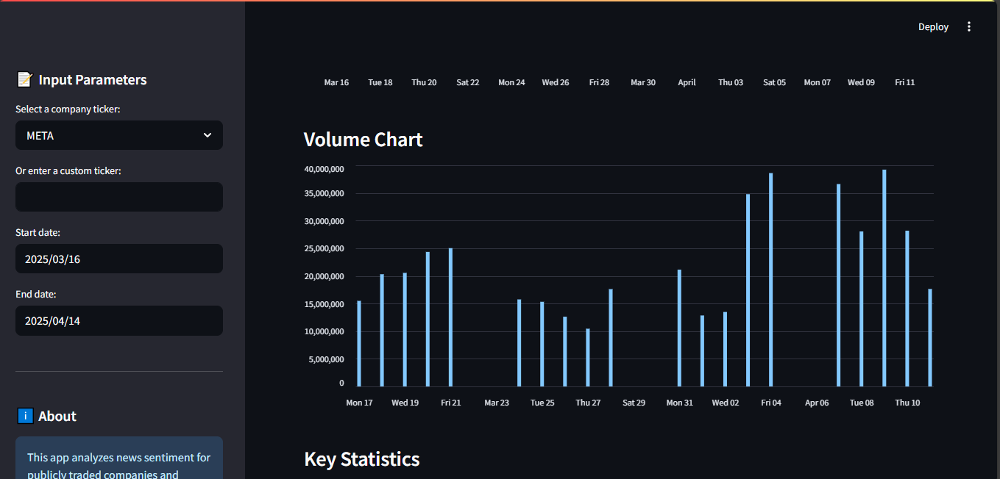

# 📊 Stock Sentiment Analysis Dashboard

This project allows users to fetch real-time news about any publicly traded company and analyze the **sentiment of headlines** using a pre-trained AI model. The app provides a **visual summary of market sentiment** and gives a simple **investment recommendation** (positive, neutral, or negative) based on the overall sentiment.


## 📁Project Structure
Stock-Sentiment-Analysis-Dashboard/
```
├── app.py                   # Main Streamlit application
├── model.pkl                # Pretrained sentiment model 
├── model.ipynb              # Pretrained sentiment model (Notebook)
├── Pictures                 # Screenshots
├── input/
│   └── Dataset.csv          # Optional large CSV dataset (LFS tracked)
├── Dockerfile               # For building the app as a Docker container
├── .env                     # Contains your NEWS_API_KEY (not committed)
├── .gitignore               # Ignoring .env, etc.
├── .dockerignore            # Prevents .env and cache from going into Docker image
├── .gitattributes           # Contains Git LFS file tracking rules
└── README.md                # README File
```

## 🧱 System Architecture

<p align="center">
  
</p>

## 🖼️ Image Previews
<!-- 📸 Image Previews -->
<p align="center">
  
  
</p>

<p align="center">
  
  
</p>


Built using **Streamlit**, **TensorFlow**, and **NewsAPI**, the app is fully containerized and can be run with **Docker**.

---

## 🚀 Features

- 🔎 Fetches latest news articles using company ticker (e.g., `AAPL`, `TSLA`, `GOOGL`)
- 💬 Applies a sentiment analysis model to headlines
- 📈 Shows visual sentiment distribution (positive / neutral / negative)
- ✅ Offers investment recommendation based on sentiment ratios
- 🐳 Fully containerized with Docker
- 🔐 Handles large datasets using Git LFS

---

## 🧠 How It Works

1. You choose a stock ticker and date range.
2. The app uses NewsAPI to fetch financial headlines related to that ticker.
3. Each headline is analyzed using a TensorFlow model.
4. Sentiment is classified as:
   - Positive 
   - Negative 
   - Neutral 
5. An investment recommendation is provided based on sentiment ratios.

---

## 📦 Prerequisites

- Python 3.9 (if running locally)
- [Docker](https://www.docker.com/get-started) (recommended for easy deployment)
- [NewsAPI Key](https://newsapi.org/) — free API key required

Create a `.env` file with:
NEWS_API_KEY=your_api_key_here


---

## 🐳 How to Run the App Using Docker

### ✅ Step 1: Build the Docker image

```bash
docker build -t stocksentiment-app .
```
### ✅ Step 2: Run the Docker container while providing the .env file that contains your NewsAPI key.
```bash
docker run --env-file .env -p 8501:8501 stocksentiment-app
```

The app will be accessible at [http://localhost:8501](http://localhost:8501)

